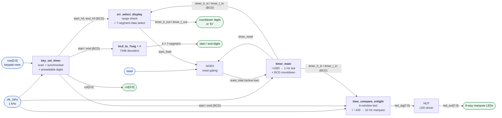
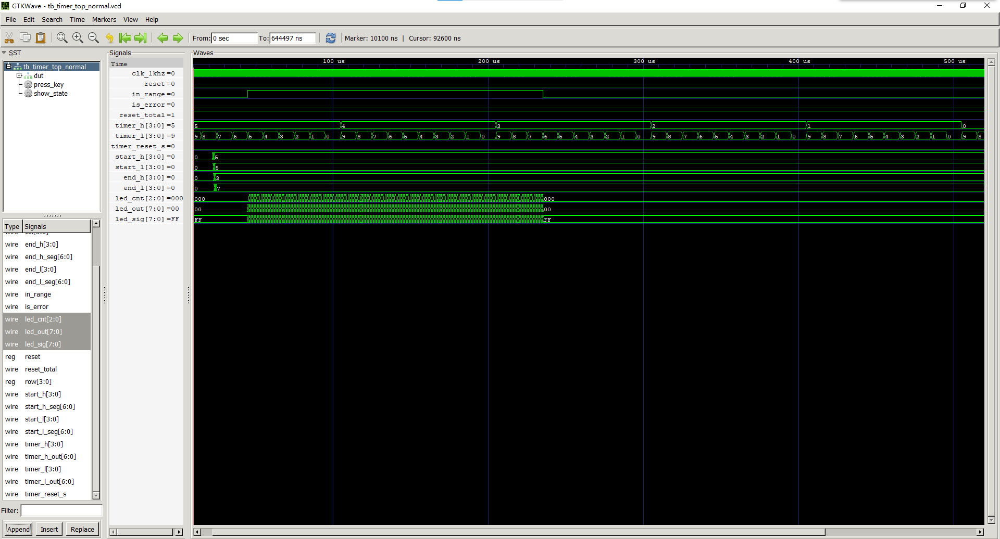
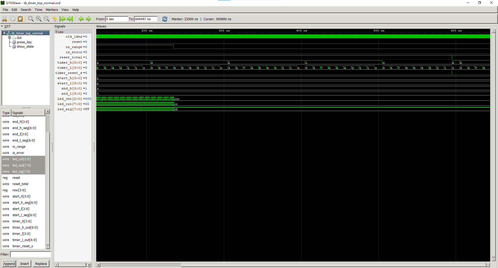
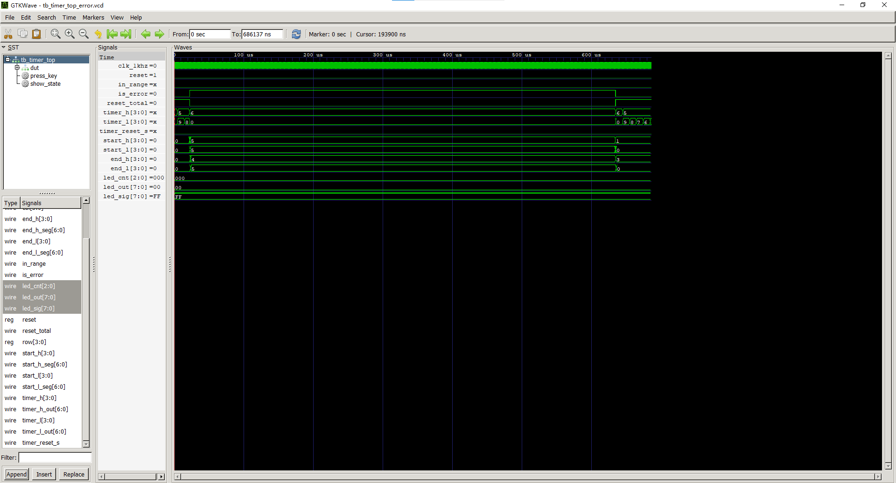

# Verilog Digital Timer with Programmable Blink Window

A synthesizable Verilog design of a **60 → 00 s BCD countdown timer** with a keyboard-programmable
activity window and an **8-step LED marquee**. The design was originally realised as a discrete
74-series logic circuit, then re-implemented in RTL, verified by simulation, and synthesised for an
Altera MAX II CPLD.

**中文说明 / Chinese documentation:** [README_zhcn.md](README_zhcn.md)

---

## Overview

The timer counts down from 60 to 00 seconds in BCD. Using a 4-key scanned keypad the user programs a
time window `[end, start]`. While the countdown passes through that window, an 8-step one-hot LED
marquee advances at 10 Hz; outside the window the LEDs are blanked and the marquee position resets.
If the programmed window is unreachable — that is, `start < end` — the countdown is inhibited and the
display shows `Er`.

Because the design began as a gate-level schematic built from 74-series SSI/MSI devices, every RTL
module maps directly onto a block of that schematic. The repository therefore also documents a
complete "hardware schematic → synthesizable RTL" translation.

## What this project demonstrates

- **Hierarchical RTL design** in Verilog, from a top-level instantiation down to leaf modules
- **Clock division with edge-detected enable pulses** instead of gated clocks
- **BCD arithmetic** with explicit borrow handling (equivalent to cascaded 74192 counters)
- **Keypad interfacing**: column drive, two-stage synchroniser, debouncing, edge-triggered events
- **Combinational magnitude comparison** of two packed BCD values (equivalent to cascaded 7485)
- **Multiplexed 7-segment display encoding**, including an out-of-range error state
- **Verification workflow**: two directed testbenches, VCD capture, waveform-based analysis
- **Synthesis-aware coding style** targeting a CPLD with fixed pin assignments

## Design origin: mapping to 74-series logic

| RTL module | Replaces (in the original schematic) | Function |
| --- | --- | --- |
| `timer_top.v` | glue logic (NOR3 gate, inverter) | Top level: sub-module instantiation, reset gating, active-low LED drive |
| `timer_main.v` | 2 × 74192 (cascaded) | 1 kHz → 1 Hz division and 60 → 00 BCD countdown with automatic reload |
| `key_set_timer.v` | keypad scan + debounce + presettable counters | Scanned keypad, sets the `start` / `end` BCD digits |
| `err_select_display.v` | 2 × 7485 + 74157 | Window validity check, 7-segment data selection with `Er` override |
| `time_compare_enlight.v` | magnitude comparator + 74138 | In-window test and 8-step marquee decode |
| `bcd_to_7seg.v` | 7448 | BCD → 7-segment decoder, active-high outputs |

## Repository layout

| Path | Description |
| --- | --- |
| `README.md` | English documentation (this file) |
| `README_zhcn.md` | Chinese documentation |
| `timer_top.v` | Top-level module |
| `timer_main.v` | Countdown engine |
| `key_set_timer.v` | Keypad scanning and time setting |
| `err_select_display.v` | Range validation and display data selection |
| `time_compare_enlight.v` | Window comparison and LED marquee |
| `bcd_to_7seg.v` | BCD to 7-segment decoder |
| `tb_timer_top_normal.v` | Functional testbench — legal window `[37, 55]` |
| `tb_timer_top_error.v` | Wide window `[45, 55]` plus illegal window `[10, 30]` (`Er` case) |
| `tb_timer_top_normal.vcd`, `tb_timer_top.vcd` | Waveform databases produced by the two testbenches |
| `timer_top.vcd` | Additional waveform capture retained from earlier runs |
| `wave_normal1.png`, `wave_normal2.png`, `wave_error.png` | Annotated waveform screenshots |
| `.gitignore` | Excludes simulation intermediates (`*.vvp`) and tool build directories |

## Architecture

The six modules connect as follows. Five of them are functional blocks ported from the original
schematic; `bcd_to_7seg` is instantiated four times, once for each static setting digit.



The same structure as plain text, for readers viewing this file outside GitHub:

```
                    clk_1khz ──┬──────────────┬───────────────┐
                               │              │               │
   row[3:0] ──► key_set_timer ─┼──► start/end (BCD) ──┬──► err_select_display ──► digits / "Er"
                     │         │                      ├──► time_compare_enlight ─► NOT ─► LEDs
                     └─ col[3:0]│                      └──► bcd_to_7seg ×4 ──────► start/end digits
                               │
              reset ──┐        │
        auto_load ────┼──► NOR3 ┴──► reset_total (active low) ──► timer_main ──► timer h/l (BCD)
      timer_reset ────┘
```

Three interconnect paths carry the behaviour of the design:

1. **Countdown → window test → LEDs.** `timer_main` publishes the live BCD value; both
   `err_select_display` and `time_compare_enlight` consume it, so the marquee and the digits always
   agree.
2. **`auto_load` → `reset_total` → `timer_main`.** The unreachable-window flag feeds the NOR3 gate
   that drives the active-low preset.
3. **`timer_reset` → `reset_total`.** The same gate turns the `00` rollover into the reload, which is
   why both paths converge on `reset_total`.

Two glue elements reproduce the original gate-level wiring:

```verilog
assign reset_total = ~(auto_load | reset | timer_reset);  // NOR3
assign led_out     = ~led_sig;                            // inverting LED driver
```

Because `timer_reset` is asserted whenever the counter reads `00`, the NOR3 gate turns an
out-of-range window or a rollover into a synchronous, active-low preset — the counter reloads to 60
instead of sitting at zero.

## Functional description

### Clocking and the countdown

The 1 kHz input clock is divided by a free-running counter. Toggling the divided signal every
500 counts yields a 1 Hz square wave, whose **rising edge is extracted by a two-stage flip-flop
delay** to produce a single-cycle enable pulse `pulse_1hz`. The countdown therefore never uses a
divided clock as a clock — all sequential logic runs on the original 1 kHz clock.

Each `pulse_1hz` performs one BCD decrement:

- unit digit `timer_l_in` decrements normally when non-zero;
- when the unit digit is `0`, it borrows: the unit digit becomes `9` and the tens digit
  `timer_h_in` decrements;
- when the counter reaches `00`, it automatically reloads to `60`.

A low-active `reset_total` synchronously presets the counter to `60`.

### Keypad time setting

The column lines are driven with the constant pattern `4'b1110`, so only the keys in one column are
read at a time. The four row inputs are passed through a two-stage synchroniser and then compared
with a further delayed copy to derive a **rising-edge key event** `key_pressed`. Each key cycles its
own setting value with wraparound:

| Key | Setting | Range |
| --- | --- | --- |
| `row[0]` | `start_h` (tens of the start time) | 0–5 |
| `row[1]` | `start_l` (units of the start time) | 0–9 |
| `row[2]` | `end_h` (tens of the end time) | 0–5 |
| `row[3]` | `end_l` (units of the end time) | 0–9 |

### Window comparison and the marquee

A second divider produces a 10 Hz enable pulse, giving the marquee its stepping rate. Because the
countdown runs from `start` down to `end`, the current value is inside the window when:

```verilog
in_range = (start_time >= end_time) &&
           (current_time <= start_time) &&
           (current_time >= end_time);
```

For example with `start = 50` and `end = 10`, the values 50, 49, … 11, 10 are all inside the window.
While `in_range` is asserted, a 3-bit counter advances on every 10 Hz pulse and is decoded into an
8-bit **one-hot, active-low** pattern; when the countdown leaves the window the counter resets and
all LEDs are driven off.

### Unreachable window and the `Er` indication

```verilog
assign is_error  = ({start_h, start_l} < {end_h, end_l});
assign auto_load = is_error;
```

If the start time is smaller than the end time the window can never be entered, so the design
asserts `auto_load`, which holds the countdown at `60`, and drives the countdown digit tubes with a
hard-coded `Er` pattern instead of a numeric value:

```verilog
localparam [6:0] SEG_ERR_H = 7'b111_1001;  // 'E' on the tens digit
localparam [6:0] SEG_ERR_L = 7'b101_0000;  // 'r' on the units digit
```

The segment encoding is `{g, f, e, d, c, b, a}` with active-high outputs, matching the 7448 decoder
convention.

## Ports and pin assignments

Top-level entity `timer_top` (pin references come from the original MAX II board assignment):

| Port | Dir | Width | Description | Pin |
| --- | --- | --- | --- | --- |
| `clk_1khz` | in | 1 | 1 kHz system clock | `PIN_18` |
| `reset` | in | 1 | External reset push-button | `PIN_20` |
| `row` | in | 4 | Keypad row inputs | `PIN_23, 24, 27, 28` |
| `col` | out | 4 | Keypad column drive | `PIN_29, 30, 31, 32` |
| `timer_h_out` | out | 7 | Countdown tens digit, 7-segment | `PIN_102…104` |
| `timer_l_out` | out | 7 | Countdown units digit, 7-segment | `PIN_88…94` |
| `led_out` | out | 8 | 8-way marquee / status LEDs (active-low) | `PIN_1…8` |
| `start_h_seg` | out | 7 | Start time tens digit | `PIN_140…142` |
| `start_l_seg` | out | 7 | Start time units digit | `PIN_130…132` |
| `end_h_seg` | out | 7 | End time tens digit | `PIN_120…122` |
| `end_l_seg` | out | 7 | End time units digit | `PIN_110…112` |

## Verification

Verification combines simulation with two directed testbenches and a synthesis check.

| Testbench | Phases | Scenarios exercised |
| --- | --- | --- |
| `tb_timer_top_normal.v` | 6 | Reset and preset to 60; release and observe 60→59→58; configure the legal window `start=55, end=37`; observe the countdown crossing the window with the marquee active; count down to `00` and observe `timer_reset` followed by the reload to 60; confirm the second cycle begins |
| `tb_timer_top_error.v` | 7 | Reset; countdown; configure the wide legal window `start=55, end=45`; observe window crossing; observe `00` and the automatic reload; configure the illegal window `start=10, end=30` (which is `start < end`); confirm `is_error` asserts and the `Er` display and blanked LEDs remain stable |

Both testbenches print a per-phase snapshot of the internal state, which makes the expected
behaviour directly checkable from the console:

```
--- Phase 4: Watch countdown crossing window [55..37] ---
[84497000]  expect ~52  -> inside window | start= 5 5 end= 3 7 timer= 5 2 | err=0 range=1 led=01111111

--- Phase 6: Configure start=10, end=30 (illegal) ---
[636137000] t=10 end=30 set  => is_error should be 1 | start= 1 0 end= 3 0 timer= 6 0 | err=1 range=0 led=11111111
```

**Methodology note.** The testbenches are directed and observational: they drive stimulus, print a
state snapshot at each phase, and dump a VCD for waveform inspection. They deliberately do **not**
contain self-checking assertions or a scoreboard, so the pass/fail judgement is made by inspecting
the printed snapshots and the waveforms rather than automatically. Making these checks self-checking
is the first item in the future-work list below.

### Synthesis check

The same RTL was synthesised in Quartus II 9.1 SP2 for an Altera MAX II device:

| Result | Value |
| --- | --- |
| Analysis & Synthesis | Successful |
| Family / top-level entity | MAX II / `timer_top` |
| Total logic elements | 172 |
| Total pins | 60 |

## Reproducing the simulation

Verified with **Icarus Verilog 12.0**. Each testbench is compiled on its own, since both instantiate
the same `timer_top` with different stimulus:

```bash
# Functional testbench — legal window [37, 55]
iverilog -g2005 -o tb_normal.vvp \
    timer_top.v timer_main.v err_select_display.v \
    time_compare_enlight.v key_set_timer.v bcd_to_7seg.v \
    tb_timer_top_normal.v
vvp tb_normal.vvp
gtkwave tb_timer_top_normal.vcd

# Error / wide-window testbench — [45, 55] and illegal [10, 30]
iverilog -g2005 -o tb_error.vvp \
    timer_top.v timer_main.v err_select_display.v \
    time_compare_enlight.v key_set_timer.v bcd_to_7seg.v \
    tb_timer_top_error.v
vvp tb_error.vvp
gtkwave tb_timer_top.vcd
```

The testbenches use `CLK_PERIOD = 10`, so one logical countdown second corresponds to 1000 clock
cycles, or 10 µs of simulated time; a full run covering two complete countdown cycles completes in
about 0.64 s of simulated time.

Two naming details that are intentional, not mistakes: the error testbench declares its module as
`tb_timer_top` and writes its waveform to `tb_timer_top.vcd`, both carried over from the original
file name.

## Waveform captures

Both testbenches call `$dumpvars` on their whole scope, so every internal signal is available in the
VCD. Each testbench additionally declares a set of top-level observation wires — these are the most
useful signals to plot:

| Observation wire | Width | Meaning |
| --- | --- | --- |
| `start_h`, `start_l`, `end_h`, `end_l` | 4 each | The programmed window, in BCD |
| `timer_h`, `timer_l` | 4 each | The live countdown value, in BCD |
| `in_range` | 1 | High while the countdown is inside `[end, start]` |
| `led_sig` | 8 | The marquee pattern: exactly one bit low while `in_range`, all ones outside |
| `led_cnt` | 3 | Marquee step counter (advances once per 10 Hz tick) |
| `is_error` | 1 | High when the programmed window is unreachable |
| `auto_load` / `reset_total` | 1 each | The reload request and the gated active-low preset |
| `timer_reset_s` | 1 | Rollover pulse asserted while the countdown reads `00` |

### Reading the timing

Three time scales appear in the traces and are worth keeping in mind: the clock period is 10 ns, one
logical countdown second is 1000 clocks (10 µs of simulated time), and the marquee advances once per
100 clocks (1 µs of simulated time). So a trace showing the countdown stepping from one BCD value to
the next is 10 µs wide, and eight marquee positions occupy 8 µs.

### 1. Normal countdown and window entry — `wave_normal1.png`



**Scenario:** the legal window `start=55, end=37` is programmed, then the countdown crosses it while
the marquee is active.

| Time | Event | Observable |
| --- | --- | --- |
| 24.497 µs | Window programmed to `start=55, end=37` | `start_h/l=55`, `end_h/l=37`, `in_range=0` |
| 54.497 µs | Countdown reaches 55 — **window entry** | `in_range` rises, `led_sig` leaves `11111111` and the marquee starts |
| 84.497 µs | Countdown at 52 | `in_range=1`, marquee has advanced |
| 234.497 µs | Countdown reaches 37 — window edge | Last cycle with `in_range=1` |
| 254.497 µs | Countdown at 35 — **window exit** | `in_range` falls, `led_sig` returns to `11111111`, `led_cnt` resets |

**What to look for:** `in_range` should be high for exactly the 18 seconds between 55 and 37, and
`led_sig` should show a single walking zero during that interval and all ones outside it.

### 2. Rollover and reload — `wave_normal2.png`



**Scenario:** the countdown runs all the way down to `00` and the automatic reload back to 60.

| Time | Event | Observable |
| --- | --- | --- |
| 604.497 µs | Countdown reads `00` | `timer_h/l=00`, `timer_reset_s` asserts |
| 604.497 µs | The NOR3 gate responds | `reset_total` is pulled low |
| 614.497 µs | Counter presets to 60 and resumes | `timer_h/l=60`, then `59` on the next tick |
| 644.497 µs | Second cycle under way | Countdown continues past `56` |

**What to look for:** the `00 → 60` transition happens in a single clock — `timer_reset_s` going high
drives `reset_total` low, and the counter is preset synchronously rather than sitting at zero for a
whole second.

### 3. Unreachable window and the `Er` display — `wave_error.png`



**Scenario:** the wide legal window `[45, 55]` is exercised first, then the illegal window
`start=10, end=30` is programmed, which is the `start < end` case.

| Time | Event | Observable |
| --- | --- | --- |
| 24.407 µs | Legal window `start=55, end=45` programmed | `is_error=0` |
| 74.407 µs | Window entered | `in_range=1`, marquee running |
| 174.407 µs | Window exited while counting | `in_range=0`, LEDs blanked |
| 624.407 µs | Countdown reaches `00` and reloads | `timer_reset_s` pulse, back to `60` |
| 636.137 µs | Illegal window `start=10, end=30` programmed | **`is_error` rises**, `auto_load` follows it |
| 686.137 µs | Er state held | `is_error=1`, `in_range=0`, `led_sig=11111111`, `timer` held at `60` |

**What to look for:** once `is_error` is high, the countdown is frozen at 60 (the preset is asserted
continuously through the NOR3 gate), `in_range` stays low so the LEDs remain blanked, and the
countdown digit outputs carry the hard-coded `E` / `r` segments instead of a number.

The raw data behind these screenshots is in `tb_timer_top_normal.vcd`,
`tb_timer_top_error.vcd` and `tb_timer_top.vcd`; they can be opened directly in GTKWave.

## Tools and environment

| Tool | Version | Role |
| --- | --- | --- |
| Icarus Verilog | 12.0 | RTL elaboration, simulation, VCD generation |
| GTKWave | — | Waveform inspection |
| Quartus II | 9.1 SP2 | Synthesis and pin assignment targeting MAX II |
| Language | Verilog-2001 | ANSI-style port declarations, synthesizable subset |

## Known limitations and future work

- **Testbenches are not self-checking.** Adding assertions or a scoreboard would turn the current
  manual inspection into an automatic regression.
- **Only one keypad column is scanned** (`col = 4'b1110`), which supports four keys; a full 4×4 scan
  would require a column counter and decoding of the active column.
- **The reload value is fixed at 60.** A user-programmable preset would need additional registers and
  comparison logic in the countdown engine.
- **Debouncing is a two-stage synchroniser with edge detection only** — sufficient for simulation,
  but a hardware keypad would benefit from a timed filter.
- **The reload path and the `auto_load` path both act through the same preset**, so the `Er` state and
  a normal rollover are distinguished only by the displayed value and the LED state.
